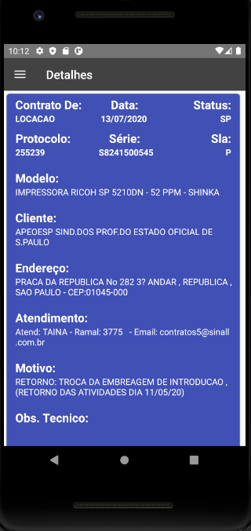
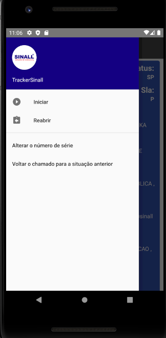

# Rastreamento e Controle de chamados dos funcionários da Empresa Sinall
  
-Controle de técnicos por supervisores 
-Controle para técnicos terem controle de seus chamados 
-Nativo Android: Kotlin, Android Studio

-recebe contagem de Toner das impressoras no cliente 
-Permite abertura do chamado apenas ao atingir um determinado perimetro de proximidade 
-Permite postergar atendimento ao cliente por falta de equipamento 
-Permite Fechar o chamado e concluir dentro do perimetro 
-Permite que supevisores possam separar chamados para funcionarios 
-Retrofit2 + PHP + SQL 

 

